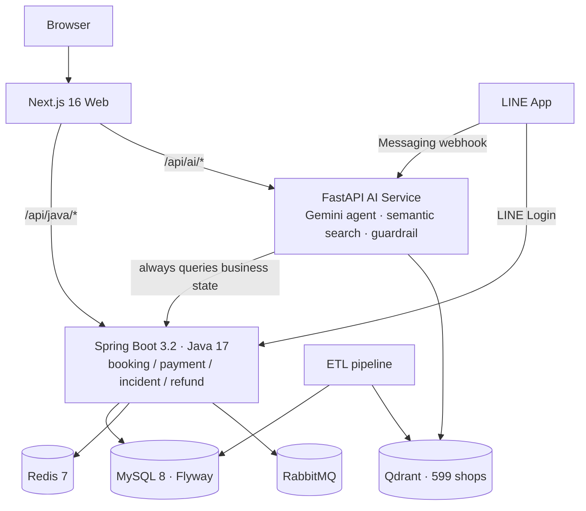

<p align="center">
  
</p>

<h1 align="center">ByteBites</h1>

<p align="center">AI dining operations platform — from a one-sentence request to an executable booking, payment and fulfillment flow</p>

<p align="center">
  <a href="https://github.com/kevinlin000/ai-enhanced-local-services/actions/workflows/portfolio-ci.yml"></a>
  
  
  
  
  
</p>

[中文版（主要文件）](README.md) — the Chinese README is the primary, most detailed document; this page is a condensed English mirror.

## What it is

Booking a group dinner in Taiwan means half an hour on Google Maps, a phone call or a booking widget, a deposit, another call when one more person joins, and yet another when you are stuck in traffic. Most AI restaurant apps only cover the first step — discovery. ByteBites wires up the whole flow: say *"4 people in Da'an tomorrow 7pm, somewhere good for conversation, bookable online"* and the system handles recommendation, booking and deposit payment; reschedules, top-ups, late arrivals and merchant counter-proposals are then handled on both Web and LINE, reading and writing **one** backend state.

The boundary that makes an AI safe to sit inside a transaction flow:

```text
AI understands intent and coordinates; the Java backend owns booking,
payment, incident and refund state.
```

The model may phrase things badly or rank imperfectly — but money and seats have exactly one consistent state at all times, protected by a state machine. Any transactional action requires a draft, an explicit user confirmation, and Java-side capacity/deposit validation.

## Numbers

| Metric | Value | Evidence |
|---|---|---|
| Active Taipei restaurants | 599 (real crawled data) | [coverage report](docs/data-coverage-report.md) |
| Restaurant photos | 3,600 (6 per shop, zero gaps/dupes) | `web/public/images/shops/` |
| Automated tests | 341 (Java 115 · Python 191 · Web 35) | [Portfolio CI](.github/workflows/portfolio-ci.yml) |
| Retrieval evaluation | Hit@5 = 15/15, versioned gold dataset | [latest report](ai-service-python/evals/report.md) |
| Engineering case studies | 15 first-hand write-ups | [index](docs/case-studies/README.md) |

## Architecture



The AI service is layered by dependency direction — anyone touching ranking only needs the ranking layer plus the eval gate:

```text
config → ranking → retrieval → agent → line_routes → main
```

## Highlights

- **Retrieval regression gate** — 15 versioned gold cases hit the live service before/after every ranking change (Hit@5 15/15, up from a 66.7% baseline). Born from a real "every fix broke something else" spiral: [case study 15](docs/case-studies/15-ranking-eval-regression-gate.md).
- **Agent tool guards** — bookings are drafted, never executed by the model; one booking per conversation; past dates rejected; multi-branch brands require disambiguation. Even if all guards failed, Java still validates capacity, identity and deposit policy.
- **Pay-first reschedule** — changing a paid booking never mutates it in place: the original stays intact, the deposit delta is settled first (online, or an audited offline-settlement escape hatch), and the change applies only after merchant confirmation.
- **Seckill flash deals** — token-bucket rate limiting → atomic Redis Lua stock/dedup → RabbitMQ async persistence → DLQ.
- **One state, two entrances** — LINE Flex card actions carry signed tokens back into the same Java transaction contract the Web uses; webhook signatures verified; internal Java↔Python calls share a secret.
- **Direct google-genai SDK** (no LangChain/LlamaIndex) — fewer layers, native function calling, tenacity retries, per-call token metrics in Prometheus. A deliberate, documented simplification of the original plan.

Design rationale lives in [ADR 0001](docs/adr/0001-java-python-frontend-split.md) (service split) and [ADR 0002](docs/adr/0002-demo-mode-merchant-auth.md) (demo-mode auth boundary) — Chinese-primary with English summaries.

## Verify

```bash
scripts/verify-portfolio.sh
```

Runs Java (115), Python (191), ETL and Web (35) tests, the data-quality gate (coverage, taxonomy, markdown links), the Nginx route contract and the release boundary check. Retrieval quality: `ai-service-python/evals/run_eval.py`. CI: [`portfolio-ci.yml`](.github/workflows/portfolio-ci.yml).

## Run locally

```bash
docker compose up -d          # MySQL / Redis / RabbitMQ / Qdrant / Prometheus / Grafana

cd backend-java && set -a; source .env; set +a && mvn spring-boot:run
cd ai-service-python && set -a; source .env; set +a && uv run uvicorn app.main:app --reload --port 8000
cd web && pnpm install && pnpm dev
```

Requires Java 17+, Python 3.12+ (uv), Node 22+ (pnpm), Docker, a Gemini API key, and optionally a LINE Developers channel. Deployment (single-host AWS with a step-by-step runbook): [docs/aws-deploy-runbook.md](docs/aws-deploy-runbook.md).

## Known limitations

Merchant auth is a designed demo-mode switch, not yet an account system ([ADR 0002](docs/adr/0002-demo-mode-merchant-auth.md)); refunds are state-machine simulated, not a real PSP; the AI runs a cost-efficient flash-lite model with seconds-level agent latency; single-host deployment with a documented Stage-2 (RDS/ElastiCache/ECS) path.

## License

Not open-source. Source available for portfolio and technical review only; no permission to copy, modify, distribute or reuse without explicit written permission.

## Contact

GitHub: [@kevinlin000](https://github.com/kevinlin000)
