<p align="center">
  
</p>

<h1 align="center">ByteBites</h1>

<p align="center">AI 用餐營運平台 — 從一句話需求，到可執行的訂位、付款與店家履約</p>

<p align="center">
  <a href="https://github.com/kevinlin000/ai-enhanced-local-services/actions/workflows/portfolio-ci.yml"></a>
  
  
  
  
  
</p>

[English version](README.en.md)

**Demo URL**：[https://bytebites-kevin.duckdns.org](https://bytebites-kevin.duckdns.org)

> 消費端可直接瀏覽 599 家店與 AI 推薦；訂位、付款、我的餐券需要 LINE 登入。**商家後台（`/merchant`）免登入即可操作**，走固定的 demo 身分管理全部 14 家展示店。單機 AWS 部署，架構與逐步指令見 [AWS 部署 Runbook](docs/aws-deploy-runbook.md)。

## 專案簡介

在台灣訂一頓聚餐，實際的流程長這樣：先在 Google Maps 和社群翻半小時找店，打電話或用訂位系統訂位，付訂金，臨時多一個人再打一次電話改訂位，當天塞車遲到又要再打一次。找店只是開頭，後面那一整段「營運」才是麻煩所在——而大部分 AI 餐廳應用只做了找店。

ByteBites 把整段流程接起來：使用者說一句「大安區 4 人明天晚上適合聊天，可訂位」，系統完成推薦、訂位、訂金付款；之後的改單、補款、晚到回報、商家替代時段提案，在 Web 和 LINE 上都能操作，讀寫的是同一套後端狀態。

要讓 AI 參與交易流程，邊界必須先畫清楚。這個專案的邊界只有一句：

```text
AI 負責理解需求與協調流程；Java 後端擁有訂位、付款、事件與退款的業務狀態。
```

模型可以說錯話，推薦可以不準，但錢和座位的狀態任何時刻只有一份，由後端狀態機保護。AI 要執行任何交易動作，都得先產生草稿、經使用者確認、再通過 Java 的容量與訂金驗證——這三道關卡缺一不可。

支撐這件事的資料也是真的：599 家台北餐廳從 Google Maps 爬取，照片、評論、
情感分析、向量索引全部對齊，有覆蓋率報告可查。

## 30 秒 Review Path

| 想快速確認 | 建議入口 |
|---|---|
| 系統樣貌與流程 | 下方「核心流程」與「系統架構」的圖，或直接看「展示影片」 |
| AI 應用深度 | 「技術亮點」1–4：eval 回歸防護網、Agent 工具守衛、Guardrail、資料管線 |
| Java 後端深度 | 「技術亮點」5–7：交易狀態機、秒殺併發、LINE 雙通道整合 |
| 資料模型 | [訂位營運 ER Model](docs/er-model-booking-operations.md)（dbdiagram DBML + 正規化說明） |
| 測試與可驗證性 | 「工程數據」表與「驗證」節：341 個自動化測試 + Hit@5 檢索評估 15/15 |
| 決策脈絡 | 「設計決策 Q&A」與 [ADR](docs/adr/0001-java-python-frontend-split.md)、[15 篇工程案例](docs/case-studies/README.md) |

## 工程數據

| 指標 | 數字 | 可查證位置 |
|---|---|---|
| 台北真實店家 | 599 家 active | [資料覆蓋率報告](docs/data-coverage-report.md) |
| 店家照片 | 3,600 張（每店 6 張，缺漏/重複 = 0） | `web/public/images/shops/` |
| 自動化測試 | 341（Java 115 · Python 191 · Web 35） | [Portfolio CI](.github/workflows/portfolio-ci.yml) |
| 檢索品質評估 | Hit@5 = 15/15，版本化 gold dataset | [最新報告](ai-service-python/evals/report.md) |
| 工程案例 | 15 篇（除錯、資料、部署的第一手紀錄） | [案例索引](docs/case-studies/README.md) |
| Commits | 600+（2026/05 起持續迭代） | git log |

## 核心流程

```text
自然語言需求
  -> 語意檢索與推薦（Qdrant + 意圖解析 + eval 防護網）
  -> 結構化推薦卡（理由、招牌菜、評論亮點）
  -> 訂位草稿 -> 使用者確認 -> 訂金付款（TapPay sandbox / demo 錢包）
  -> Web / LINE 讀寫同一套交易狀態
  -> 對話式改單（差額先補款、店家確認後生效）
  -> 晚到回報 -> 商家替代時段提案 -> 顧客接受/拒絕
  -> 補款 / 退款 / 營運摘要
  -> 私人偏好記憶（「太吵」「不再推薦」會影響後續推薦）
```

最能代表系統邊界的流程是**晚到回報（incident）**：

1. 使用者對 AI 說：`我塞車會晚到 20 分鐘`。
2. AI 不自行猜測訂位，而是從 Java 查詢最近有效訂位。
3. Java 建立 `tb_booking_incident`，Web 與 LINE 同步顯示最新事件。
4. 商家後台提出替代時段；顧客可從 Web 或 LINE 接受 / 拒絕。
5. Java 驗證座位、身份與訂金政策後才改單；涉及差額時建立 TOP_UP / REFUND adjustment，**先完成金流、店家確認後改單才生效**。
6. 店家處理完成後，顧客端的訂位卡會顯示處理結果——回饋迴路是雙向的。

## 核心功能

| 介面 | 功能 | 現況 |
|---|---|---|
| 消費端 Web | 餐廳探索（分類 / 捷運 / 篩選）、餐廳詳情（真實評論、ABSA 摘要、附近停車、可訂時段） | 599 家店資料齊備 |
| 消費端 Web | AI 對話：推薦、追問收斂、訂位草稿、改單、晚到回報 | SSE 真串流，含推薦上下文的多輪對話 |
| 消費端 Web | 我的訂位（付款 / 改期 / 取消 / 補款 / 事件狀態）、我的餐券、收藏、空位通知 | 與 LINE 共用同一套交易狀態 |
| 付款 | TapPay sandbox 信用卡（pay-by-prime）+ demo 錢包 | demo 錢包同樣回寫真實 settlement 狀態 |
| LINE | Login 登入、Bot 對話推薦、Flex 卡片訂位、狀態推播、晚到協調 | 雙 channel：Login 管身份、Messaging 管對話 |
| 商家後台 | 時段容量（直接控制雙端可訂庫存）、現場事件佇列、替代時段提案、訂金差額（補收 / 退款 / SLA 監控）、限時餐券 | demo 模式免登入，邊界見 [ADR 0002](docs/adr/0002-demo-mode-merchant-auth.md) |
| 秒殺 | 限時餐券搶購：令牌桶限流 + Redis Lua 預扣 + Redis Stream 非同步落庫 | 訂單出現在「我的餐券」 |
| 偏好記憶 | 用餐後記錄「太吵 / 不再推薦」，影響後續 AI 推薦 | 推薦卡會標示記憶原因 |

## 畫面截圖

以下截圖取自線上 demo。消費端瀏覽免登入；商家後台走固定的 demo 身分，同樣不用登入即可操作、管理全部 14 家展示店。

**首頁** — 一句話說需求，AI 直接接手；下方是分類與捷運快速入口。

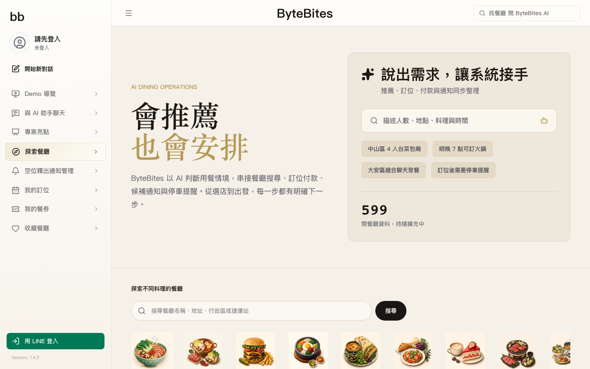

**餐廳探索** — 599 家台北店家，依分類、評分、限時餐券快速篩選。

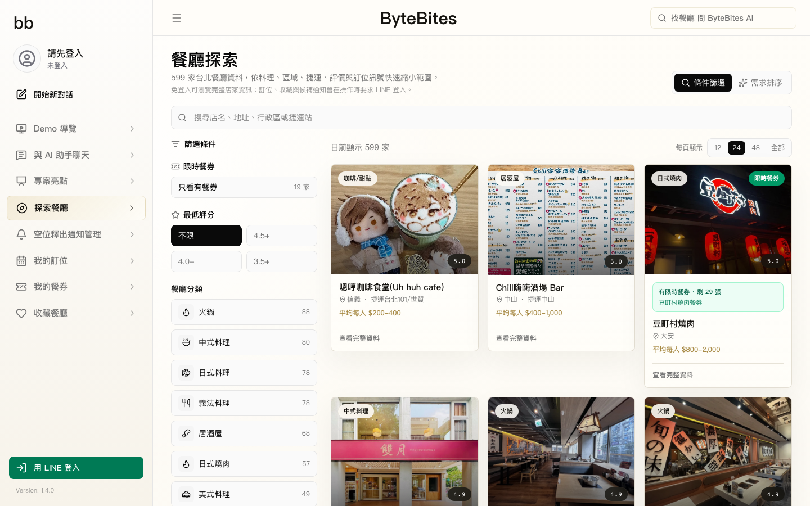

**餐廳詳情** — 真實評論、ABSA 情感摘要、附近停車、可訂時段整合在同一頁。

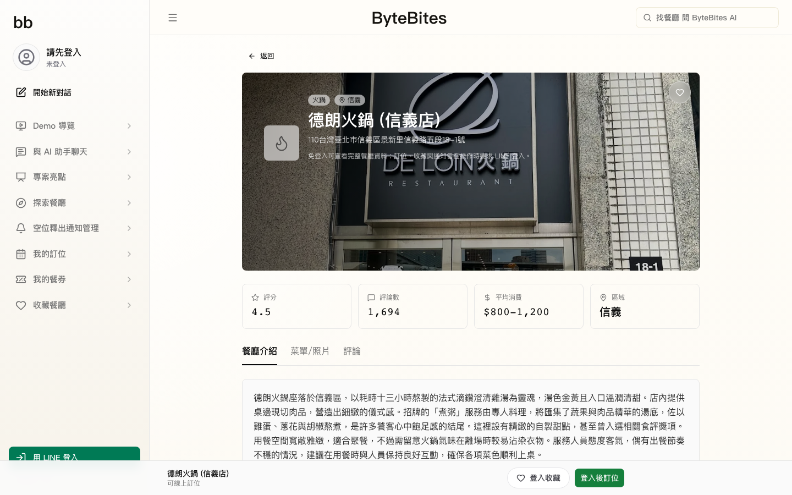

**AI 對話** — 自然語言描述需求，AI 用 SSE 真串流回結構化推薦與訂位草稿。

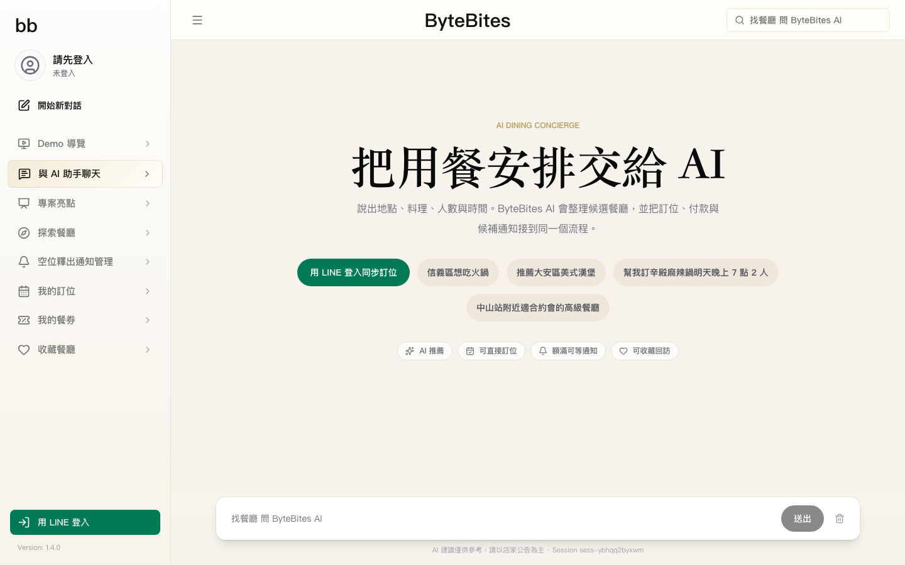

**商家營運台** — 免登入即可操作，切換 14 家展示店管理工作佇列、訂金退款、時段容量、限時餐券。

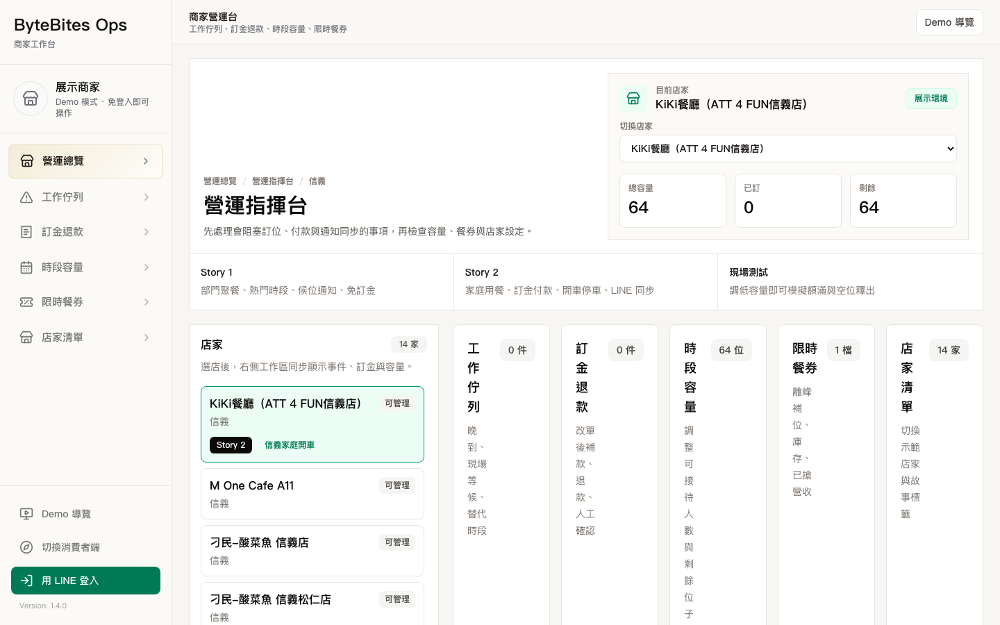

**時段容量** — 調整可接待人數直接影響 Web / LINE 的可訂庫存，改單與空位通知讀同一份資料。

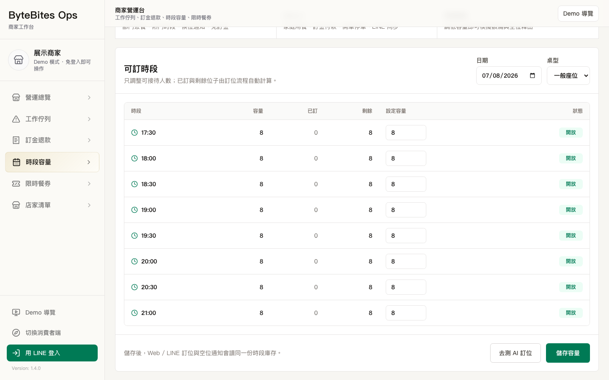

**工程總覽頁**（`/showcase`）— 系統的證據頁：真實數據、系統邊界、可驗證的工程實證。

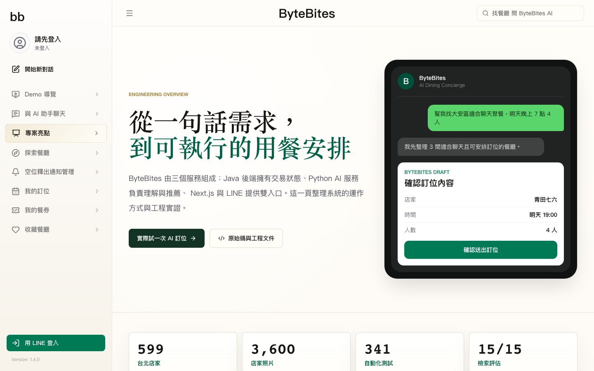

**功能導覽頁**（`/demo`）— 五分鐘走完一次用餐的完整旅程。

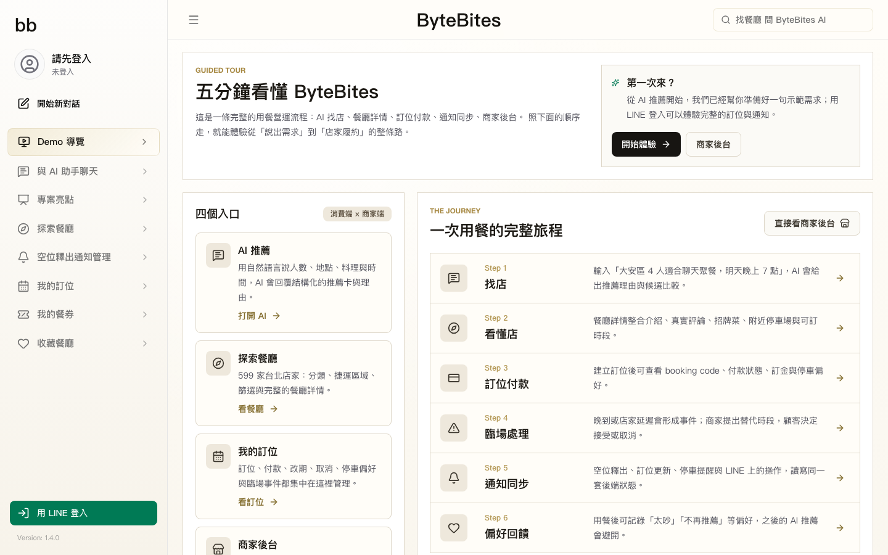

## 展示影片

### 多輪對話訂位：從破碎需求到候補通知

[](https://youtu.be/ttxynxWrPvk)

單輪查詢很少長得像規格書。這支影片示範系統怎麼處理一句話裡混雜的多個條件、怎麼在多輪對話裡累積上下文、以及訂位額滿後的候補流程：

- 第一輪輸入同時帶時間、地點、預算、過敏排除（不吃蝦蟹）與軟性偏好（偏愛肉類），系統從候選中篩出符合全部條件的名單。
- 追加「主管也會去」後，排序邏輯切換到部門聚餐情境，回答改成服務節奏、推薦菜、避雷指南的比較，而不是單純的星等排序。
- 最後一輪只說「時間延後、人數變 8 人」，系統從對話狀態取回先前鎖定的店家與條件，覆蓋更新後直接建立訂位——不需要重新輸入完整需求。
- 目標時段額滿時，改用空位候補；商家後台釋出容量後，LINE 與 Web 同步收到候補通知。
- 該店均消低於訂金門檻，訂位不需訂金即直接成立。

### 訂位後的停車提醒

[](https://youtu.be/tZZdrug-htk)

服務不在訂位成立那一刻結束。這支影片示範系統怎麼捕捉「會開車」這個隱性意圖，並把提醒延伸到出發前：

- 訂位建立時，系統從對話內容判斷使用者會開車，記錄在該筆訂位上。
- 訂位完成後，頁面主動出現停車提醒的入口，不需要使用者自己想到要問。
- 點擊後，LINE 立刻收到停車提醒卡片，附近車場資訊與「保留最近車位」的操作都在同一張卡片完成。

## 系統架構

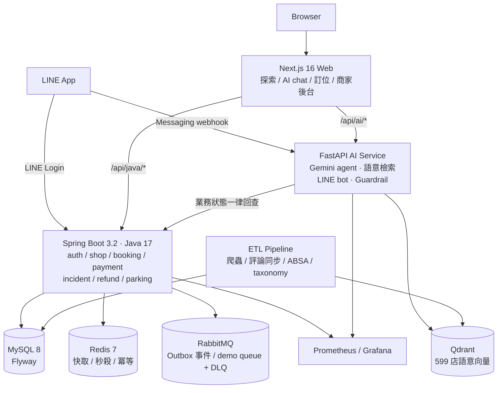

AI 服務內部依依賴方向分層，改排序前必跑檢索評估：

```text
config → ranking → retrieval → agent → line_routes → main
（設定/client）（意圖解析與排序）（Qdrant檢索）（工具呼叫迴圈）（LINE 流程）（組裝）
```

完整說明：[架構總覽](docs/architecture-overview.md) ·
AI 模組分層：[`ai-service-python/CONTEXT.md`](ai-service-python/CONTEXT.md)

## 工程設計

### 訂位與差額狀態流轉

已付款訂位的改單不是直接改 DB：原單全程受保護，差額先走金流，店家確認後才套用。

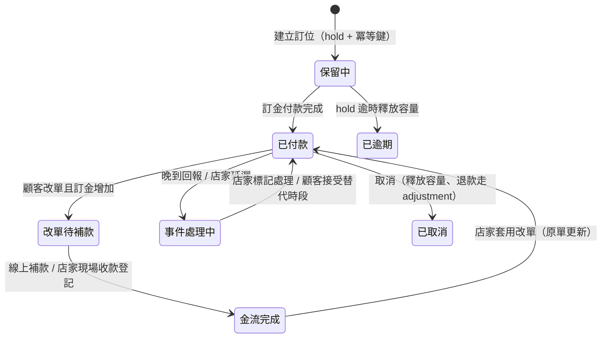

- 補款有兩條路：顧客線上付款（TapPay prime / demo 錢包），或店家**現場收款登記**——後者是刻意設計的逃生門：收款方式與原因必填、provider 記為 `OFFLINE_*`、寫入 audit log。
- 退款不直接改狀態，由 `TOP_UP / REFUND adjustment` + SLA 監控（卡單、失敗、升級）管理。

### 資料模型

訂位營運核心表（booking / incident / deposit_adjustment / availability watch）的完整 DBML 與 1NF–3NF 說明：[訂位營運 ER Model](docs/er-model-booking-operations.md)。

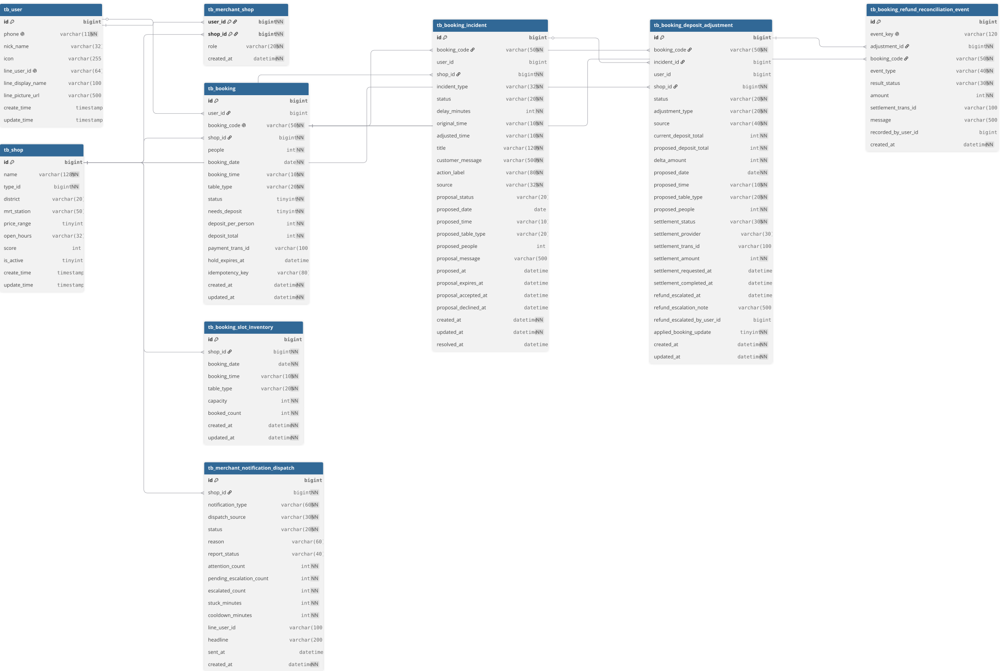

## 技術棧

| 區塊 | 技術與責任 |
|---|---|
| Backend | Spring Boot 3.2 / Java 17、Spring Data JPA、Spring Security + JWT（Bearer 與 HttpOnly cookie 雙軌）、Flyway、Redisson |
| 交易與併發 | 訂位 hold + 冪等鍵、秒殺令牌桶限流 + Redis 庫存 + Redis Stream 非同步落庫、差額補款/退款狀態機 |
| AI service | FastAPI、google-genai SDK 直連 Gemini（function calling agent）、Qdrant 語意檢索、自製 guardrail 與 Hit@K eval harness、tenacity 重試、token 成本指標 |
| Data / ETL | Python ETL：Google Maps 爬蟲、評論同步（Mongo）、ABSA 情感分析、taxonomy 稽核、Qdrant payload 同步 |
| Frontend | Next.js 16 / React 19 / TypeScript / Tailwind 4，消費端 + 商家後台 + LINE 內嵌頁三種介面 |
| LINE | Login 與 Messaging API 雙 channel 分離；webhook 簽章驗證；Flex 卡片操作回 Java 交易驗證 |
| Storage | MySQL 8（Flyway 版本化 migration）、Redis 7、RabbitMQ（Outbox 事件發布、demo queue／DLQ）、Qdrant、Mongo-backed reviews |
| 可觀測性 | Prometheus（含每次 LLM 呼叫的 token/延遲指標）+ Grafana provisioning |
| 部署 | Docker 化三應用（本機驗證過的 Dockerfile）、單機 AWS compose + 主機 Nginx/Let's Encrypt（[runbook](docs/aws-deploy-runbook.md)）、本機 ngrok demo |
| 驗證 | 341 個測試、Portfolio CI 四車道、檢索 eval、release readiness、clean-schema migration smoke |

## 技術亮點

| 亮點 | 工程重點 | 可查證位置 |
|---|---|---|
| 檢索品質回歸防護網 | AI 排序改動前後必跑 Hit@5 eval，版本化 gold dataset，杜絕「越修越壞」 | [`evals/`](ai-service-python/evals/report.md)、[案例 15](docs/case-studies/15-ranking-eval-regression-gate.md) |
| Agent 工具守衛 | 訂位/付款是高風險動作：AI 只產生草稿，確認後才執行；一次對話最多一筆訂位 | `ai-service-python/app/agent.py`、[案例 10](docs/case-studies/10-ai-dialogue-state.md) |
| Guardrail 雙向防護 | 輸入擋 prompt injection，輸出句級遮蔽（不因一個字眼毀掉整個回答） | `ai-service-python/app/guardrail.py` + 測試 |
| 資料品質管線 | 599 店的照片/評論/ABSA/taxonomy/向量全部對齊且有覆蓋率 gate | [資料覆蓋率報告](docs/data-coverage-report.md)、[案例 02](docs/case-studies/02-absa-pipeline.md)、[案例 06](docs/case-studies/06-data-crawler-coverage.md) |
| 交易狀態機 | 訂位、付款、改單、事件、補款、退款集中由後端狀態流轉管理；AI 與前端都不持有權威狀態 | `backend-java` booking/payment/incident services + 115 測試 |
| 秒殺與併發 | 限時餐券：令牌桶限流 + Redis 預扣 + Lua 冪等 + Redis Stream 非同步落庫；容量正確性以既有測試與條件式原子更新驗證，不宣稱完成壓測或無超賣壓測 | `VoucherOrderController`、`seckill.lua` |
| Web / LINE 單一狀態 | 兩個入口、同一套交易 contract；LINE Flex 卡片的接受/拒絕回 Java 驗證 | [案例 07](docs/case-studies/07-web-line-booking-sync.md) |
| 效能與查詢證據 | 熱路徑 SQL、索引與程式碼錨點對照 | [效能與查詢證據](docs/performance-query-evidence.md) |
| 真串流 | Agent 回覆 SSE 真串流，可量測 TTFT | [案例 01](docs/case-studies/01-sse-streaming-debug.md) |

RabbitMQ 在本專案用於 Outbox 事件發布與 demo queue／DLQ；秒殺訂單非同步寫單使用 Redis Stream。容量正確性目前以既有測試與條件式原子更新驗證；repo 沒有 load test／benchmark 產物，不宣稱完成壓力測試或無超賣壓測驗證。

## 設計決策 Q&A

### Q1. 為什麼拆成 Java 後端 + Python AI 服務，而不是單體或微服務？

核心複雜度在「交易一致性」與「AI 迭代速度」的節奏不同：訂位付款需要穩定的狀態機與強測試，AI 排序需要高頻實驗。拆成兩個服務讓兩種節奏互不干擾，同時保持「Java 拿掉 AI 仍是合格後端作品、Python 獨立拿出去仍是合格 AI 作品」。再細拆就是把資料庫交易能解的問題變成分散式交易，得不償失。完整脈絡見 [ADR 0001](docs/adr/0001-java-python-frontend-split.md)。

### Q2. 為什麼 AI 層直連 google-genai SDK，不用 LangChain / LlamaIndex？

早期規劃曾寫 LlamaIndex + LiteLLM，實作後刻意簡化：直連 SDK 抽象層最少、function calling 原生支援、重試（tenacity）與 token 計量（Prometheus）自己掌控，**每一層行為都能在面試中解釋**。框架的價值在快速拼裝，這個專案的價值在展示對每層的理解。

### Q3. 檢索品質怎麼保證？為什麼不用 RAGAS？

自製 eval harness：15 個版本化 gold case 打 live service 算 Hit@5。它解決的是真實發生過的問題——排序邏輯每修一個 case 就壞另一個，直到把 eval 當成排序系統的 CI（改前改後必跑）才止血，從 66.7% 修到 100%。RAGAS 適合泛用 RAG 品質面向，這裡需要的是針對自家 taxonomy 與意圖解析的回歸測試，自製更準也更能講清楚。過程見[案例 15](docs/case-studies/15-ranking-eval-regression-gate.md)。

### Q4. AI 會不會直接幫使用者下訂造成錯誤交易？

不會。Agent 有工具守衛：訂位工具只在使用者明確確認草稿後執行、一次對話最多一筆訂位、今天/過去日期直接擋下、同品牌多分店必先詢問。所有交易最終由 Java 驗證容量、身份與訂金政策——AI 說錯話最多是推薦不準，不會產生錯誤的錢或座位狀態。

### Q5. 為什麼改單要「先補款、店家確認後生效」，不直接改？

已付款訂位的改單牽動訂金差額與容量。原單保留不變、差額先走金流、店家確認後套用——任何時刻錢與座位都有一致狀態，這與高鐵改票、飯店改訂同構。店家「現場收款登記」是刻意保留的逃生門（現金/轉帳場景），但方式與原因必填、寫 audit log，付款狀態不能被收錢方無聲宣告。

### Q6. 商家後台為什麼 demo 模式免認證？

商家帳號模型（onboarding、綁店、角色）是完整的 v2 功能，不是一個 filter 能補的。demo 模式的邊界是**設計好的開關**：`strict-mode` 一開，同一批路由立即要求認證；`ProductionSecurityGuard` 在啟動時驗證「strict-mode 關閉不得作為 production 部署」。見 [ADR 0002](docs/adr/0002-demo-mode-merchant-auth.md)。

### Q7. 秒殺為什麼用 Redis Stream？RabbitMQ 用在哪裡？

秒殺流程由 `seckill.lua` 以 `XADD stream.orders` 寫入 Redis Stream，再由 `VoucherOrderServiceImpl` 的 consumer group `g1`／consumer `c1` 非同步落庫。RabbitMQ 在本專案實際用於 Outbox 事件發布，以及 demo queue／DLQ；不是秒殺訂單隊列。

### Q8. LINE 整合的難點在哪？

兩個 channel（Login 給身份、Messaging 給對話）+ 三個介面（Web、LINE 對話、LINE 內嵌 HTML 頁）共用一套交易狀態。關鍵設計：LINE 只是 action channel，Flex 卡片上的接受/拒絕都帶簽章 token 回 Java 驗證，不在對話裡結案；webhook 有簽章驗證；Java→Python 的內部通知有共享 secret。曾經踩過 Web 與 LINE 兩套身份對不上的坑，收斂過程見[案例 07](docs/case-studies/07-web-line-booking-sync.md)。

### Q9. AI 服務為什麼單 worker？

session 存 Redis，但 LINE media/profile 快取、embedding 快取仍是 in-process。demo 流量單 worker 足夠；要水平擴展的路徑很清楚——把剩餘 in-process 狀態外部化到 Redis 即可，這是已知且已文件化的取捨。

### Q10. 這個專案不追求什麼？

不追求正式 SaaS 上線、多租戶商家體系、真實金流合約、K8s 與高可用叢集。現階段優先序是把「AI 理解 → 交易狀態 → 雙入口同步 → 可驗證交付」這條線做穿。上線缺口誠實列在「上線邊界」。

## 驗證

單一作品驗證入口：

```bash
scripts/verify-portfolio.sh
```

| 區塊 | 指令 | 目的 |
|---|---|---|
| Backend Java | `mvn test` | 訂位、付款、LINE、incident、refund、parking contract tests |
| AI service | `uv run --no-sync pytest tests -q` | agent conversation、LINE flow、guardrail、internal notification contracts |
| ETL pipeline | `uv run --no-sync pytest tests -q` | taxonomy、normalizer、audit sync、data-quality tests |
| 檢索品質 | `ai-service-python/evals/run_eval.py` | Hit@5 回歸防護網（15 案例，[最新報告](ai-service-python/evals/report.md)）；改 ranking 前後必跑 |
| Data quality gate | `python3 scripts/verify-data-quality.py` | 覆蓋率、eval manifests、taxonomy、case studies、Markdown links |
| Nginx contract | `python3 scripts/verify-nginx-template.py` | public reverse-proxy routes、LINE URLs、proxy headers |
| Clean migration smoke | `scripts/smoke-clean-mysql-migrations.sh --dry-run` | 乾淨 schema 可從 Flyway 直接啟動 |
| Release boundary | `python3 scripts/verify-release-boundary.py` | release handoff、verification ladder、production-gap framing |
| Query evidence | `python3 scripts/verify-performance-query-evidence.py` | hot query paths、indexes、code anchors |
| Web | `pnpm test` / `pnpm build:ci` | UI contract tests 與 production build |

CI 位於 [`portfolio-ci.yml`](.github/workflows/portfolio-ci.yml)（Java / Python / ETL / Web 四車道 + data quality gate）。乾淨 MySQL schema 啟動驗證位於 `clean-mysql-migration-smoke.yml`，採手動觸發。

## 精選工程案例

每篇都是第一手除錯與決策紀錄，不是事後包裝：

- [AI 回答不穩定 — 從「越修越壞」到 eval 回歸防護網](docs/case-studies/15-ranking-eval-regression-gate.md)
- [AI Agent 真實串流 — 從假串流到可量測 TTFT](docs/case-studies/01-sse-streaming-debug.md)
- [ABSA 評論分析 Pipeline — 可溯源評論智能](docs/case-studies/02-absa-pipeline.md)
- [資料爬蟲與覆蓋率 — 599 家可用店的資料基礎](docs/case-studies/06-data-crawler-coverage.md)
- [Web / LINE 訂位同步 — 從兩套身份到同一個交易狀態](docs/case-studies/07-web-line-booking-sync.md)
- [AI 對話狀態 — 從單輪問答到可完成任務的 Agent](docs/case-studies/10-ai-dialogue-state.md)
- [公開展示部署 — 從本機可跑到外部可開](docs/case-studies/11-demo-deployment.md)

完整列表：[工程案例索引](docs/case-studies/README.md)

## 系統需求

- Java 17+、Maven
- Python 3.12+、uv
- Node.js 22+、pnpm
- Docker（MySQL 8 / Redis 7 / RabbitMQ / Qdrant / Prometheus / Grafana）
- Google AI Studio API key（Gemini）；LINE Developers channel（可選，跑 LINE 流程時需要）

## 本機啟動

```bash
docker compose up -d

cd backend-java
set -a; source .env; set +a        # 參考 .env.example
mvn spring-boot:run

cd ../ai-service-python
set -a; source .env; set +a
uv run uvicorn app.main:app --reload --port 8000

cd ../web
pnpm install && pnpm dev
```

常用入口：

- Web: `http://localhost:3000` · Java: `http://localhost:8081` · AI: `http://localhost:8000`
- RabbitMQ: `http://localhost:15672` · Qdrant: `http://localhost:6333`
- Prometheus: `http://localhost:9090` · Grafana: `http://localhost:3001`

正式 demo 前：

```bash
scripts/release-readiness.sh --offline
scripts/smoke-clean-mysql-migrations.sh --timeout 180
```

## 部署

單機 AWS staging（EC2 + docker compose 七容器 + 主機 Nginx + Let's Encrypt）已完成，三個應用的 Dockerfile 皆在本機建置並煙霧測試過。逐步指令、資料搬遷（mysqldump + Qdrant snapshot）、LINE console 切換與 TapPay IP 白名單見：

- [AWS 部署 Runbook](docs/aws-deploy-runbook.md)（每步含驗證命令）
- [兩階段部署計畫](docs/deployment-aws.md)（Stage 2：RDS / ElastiCache / ECS 演進路徑）
- [Nginx 公開路由契約](docs/deployment-nginx.md)

## 已知限制

| 範圍 | 目前狀態 | 後續方向 |
|---|---|---|
| 商家認證 | demo 模式免認證（strict-mode 開關 + 啟動守衛已就位） | merchant onboarding 帳號模型，見 [ADR 0002](docs/adr/0002-demo-mode-merchant-auth.md) |
| 改單套用 | 差額金流完成後由店家人工確認套用 | 容量足夠時自動套用，店家只處理例外 |
| 付款 | TapPay sandbox（信用卡）+ demo 錢包；退款為狀態機模擬 | 真實 PSP 退款供應商整合 |
| AI 模型 | gemini-flash-lite（成本考量），agent 延遲數秒 | 升級模型檔位、預先快取常見查詢 |
| 高可用 | 單機部署、AI 服務單 worker | Stage 2 拓樸（RDS / ElastiCache / ECS）已文件化 |

## 專案結構

```text
ai-enhanced-local-services/
├── backend-java/          # Spring Boot：auth、shop、booking、payment、incident、refund、parking
├── ai-service-python/     # FastAPI：Gemini agent、語意檢索、LINE bot、guardrail、evals
├── web/                   # Next.js：探索、AI chat、訂位、我的餐券、商家後台
├── etl-pipeline/          # 爬蟲、評論同步、ABSA、taxonomy 稽核、Qdrant 同步
├── deploy/                # AWS compose、Nginx 模板、Prometheus / Grafana provisioning
├── scripts/               # verify-portfolio、release readiness、demo readiness 等閘門
└── docs/                  # 架構、ER model、部署 runbook、ADR、15 篇工程案例
```

## 授權

This project is not open-source.

Source code is available for portfolio and technical review only. No permission
is granted to copy, modify, distribute, sublicense, publish, or reuse this
project, in whole or in part, without explicit written permission.

## 上線邊界

這是已具備作品展示品質、並由合約測試保護的專案，不宣稱已完成正式 SaaS 上線。真正上線仍需要：受管祕密、雲端資料庫與備份還原演練、長期觀測與告警、真實 PSP 退款供應商整合、商家帳號體系與營運手冊。

## 聯絡

- GitHub: [@kevinlin000](https://github.com/kevinlin000)
