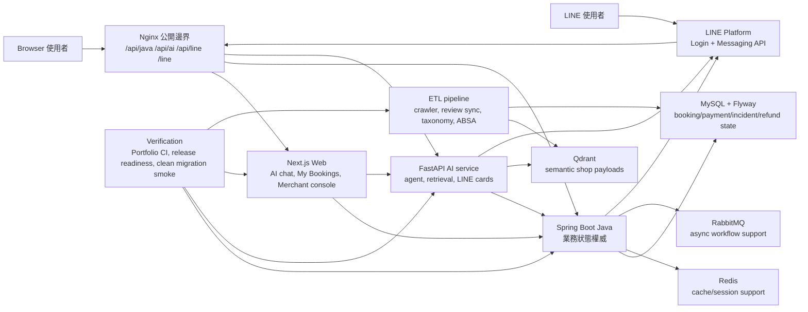

# ByteBites 架構總覽

ByteBites 的架構圍繞一個邊界：

```text
AI 負責理解與協調流程。
Java 負責業務狀態。
```

AI service 可以推薦、追問、路由意圖與產生 LINE Flex card，但不作為訂位、付款、救場、替代時段提案或退款狀態的 source of truth。

## 系統圖



## 權責邊界

| 能力 | 負責系統 | 原因 |
|---|---|---|
| 訂位生命週期 | Java | 需要交易式處理座位、訂位、付款與改單規則。 |
| 臨場救場 incident | Java | `OPEN` / `RESOLVED`、proposal 狀態、期限與顧客操作都需要可重放的持久化狀態。 |
| 補款 / 退款 adjustment | Java | 付款義務與 reconciliation 不能由模型猜測。 |
| 推薦文案與追問 | AI service | 檢索、對話策略與生成式說明屬於 AI orchestration。 |
| LINE Flex card | AI service | card 是呈現層；accept / decline 仍回到 Java contract。 |
| 顧客與商家 UI | Next.js Web | Web 呈現 Java payload 與 AI response，不擁有 domain state。 |
| 公開路由 | Nginx | 穩定承接 Web、Java、AI、LINE webhook、LINE action pages 與 health checks。 |
| 資料補強 | ETL pipeline | crawler、taxonomy、review analysis、media coverage 與 Qdrant sync 不應在 request-time API 裡做。 |

## 關鍵流程

臨場救場是最能代表架構邊界的流程：

```text
LINE / Web 使用者說會晚到
  -> AI 只判斷意圖
  -> Java 找最近有效訂位
  -> Java 建立 tb_booking_incident
  -> AI 產生 LINE rescue / proposal card
  -> 商家提出替代時段
  -> 顧客從 Web / LINE 接受或拒絕
  -> Java 驗證並改變訂位狀態
```

這個流程展示的重點是：AI 可以協調，但 Java 仍是狀態權威。

## 驗證邊界

| 層級 | 證據 |
|---|---|
| 本機完整驗證 | `scripts/verify-portfolio.sh` |
| 發表前離線驗證 | `scripts/release-readiness.sh --offline` |
| 發表前完整驗證 | `scripts/release-readiness.sh --full` |
| 公開路由合約 | `python3 scripts/verify-nginx-template.py` |
| 乾淨 schema 啟動證明 | `scripts/smoke-clean-mysql-migrations.sh --timeout 180` 與 `.github/workflows/clean-mysql-migration-smoke.yml` |

因此這個專案應該被呈現為「可驗證的作品 release」，而不是只靠現場 demo 撐住的功能展示。
