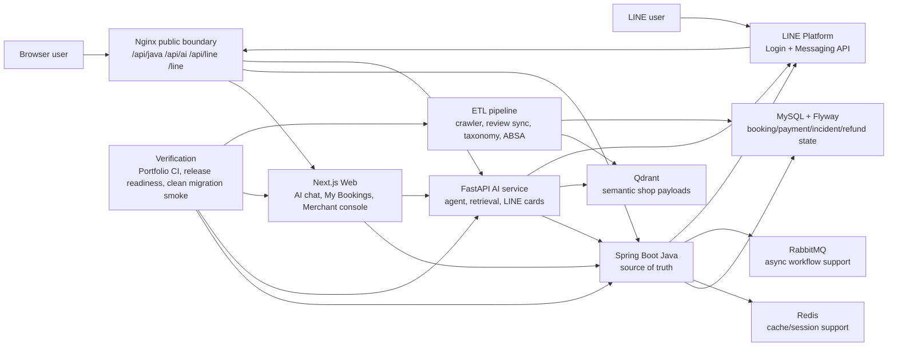

# ByteBites Architecture Overview

ByteBites is designed around one boundary:

```text
AI orchestrates the dining workflow.
Java owns business state.
```

The AI service can recommend, clarify, route, and render LINE cards. It does not become the source of truth for booking, payment, incident, proposal, or refund state.

## System Diagram



## Ownership Boundaries

| Capability | Owner | Reason |
|---|---|---|
| Booking lifecycle | Java | Requires transactional slot, booking, payment, and reschedule rules. |
| Incident state | Java | OPEN/RESOLVED, proposal status, expiry, and customer actions need deterministic persistence. |
| Deposit/refund adjustment | Java | Payment obligations and reconciliation cannot be guessed by the model. |
| Recommendation text and clarification | AI service | This is where retrieval, dialogue policy, and generated explanation belong. |
| LINE Flex card rendering | AI service | The card is presentation/orchestration; actions still call Java contracts. |
| Merchant and customer UI | Next.js Web | Web surfaces Java payloads and AI responses without owning domain state. |
| Public routing | Nginx | Stable route boundary for Web, Java, AI, LINE webhook, LINE action pages, and health checks. |
| Data enrichment | ETL pipeline | Crawler, taxonomy, review analysis, media coverage, and Qdrant sync live outside request-time APIs. |

## Critical Flow

Real-time incident handling is the best single architecture example:

```text
LINE/Web user says they will be late
  -> AI routes intent only when needed
  -> Java finds the recent valid booking
  -> Java creates tb_booking_incident
  -> AI renders LINE rescue/proposal cards
  -> Merchant proposes alternative slot
  -> Customer accepts or declines from Web/LINE
  -> Java validates and mutates booking state
```

That flow demonstrates the core design principle: AI can coordinate, but Java remains the state authority.

## Verification Boundary

The architecture is protected by four verification layers:

| Layer | Evidence |
|---|---|
| Local full gate | `scripts/verify-portfolio.sh` |
| Release gate | `scripts/release-readiness.sh --offline` and `scripts/release-readiness.sh --full` |
| Public-route contract | `python3 scripts/verify-nginx-template.py` |
| Fresh-schema proof | `scripts/smoke-clean-mysql-migrations.sh --timeout 180` and `.github/workflows/clean-mysql-migration-smoke.yml` |

This is why the project should be presented as a verified portfolio release, not just a running demo.
