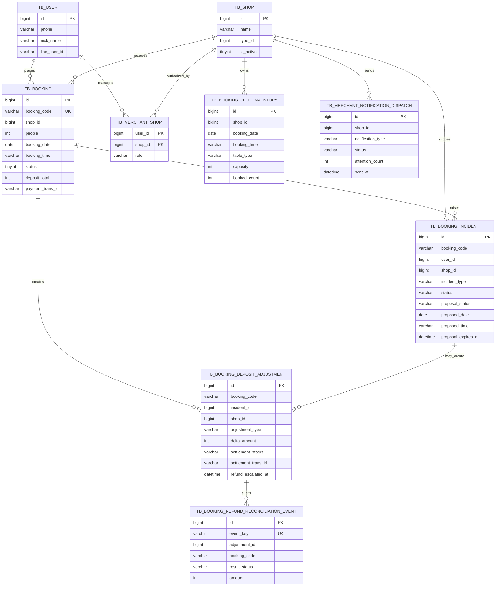

# ByteBites Booking Operations ER Model

This ER model focuses on the portfolio-critical workflow: recommendation becomes booking, booking can create incidents, incidents can create proposals, and paid booking changes can create deposit/refund operations.

It intentionally does not show every crawler, taxonomy, review, ABSA, or cache table. For interviews, the useful model is the Java-owned operational state model.

## Core Tables

| Table | Role |
|---|---|
| `tb_user` | Customer or merchant account. |
| `tb_shop` | Restaurant profile and merchant-owned operational unit. |
| `tb_merchant_shop` | Merchant-to-shop authorization mapping. |
| `tb_booking_slot_inventory` | Java-owned availability snapshot used for booking and proposal validation. |
| `tb_booking` | Source-of-truth booking record, including booking code, party size, time, payment state, and deposit totals. |
| `tb_booking_incident` | Real-time rescue incident and single pending proposal state. |
| `tb_booking_deposit_adjustment` | Manual or PSP-tracked top-up/refund adjustment created when paid booking changes affect deposits. |
| `tb_booking_refund_reconciliation_event` | Idempotent audit log for refund request/reconciliation callbacks. |
| `tb_merchant_notification_dispatch` | Cooldown and audit state for merchant operations notifications. |

## Diagram

## Interview Talking Points

- `tb_booking.booking_code` is the stable workflow key used across Web, LINE, incident, and payment operations.
- `tb_booking_incident` keeps the current proposal on the incident for the portfolio version: one incident, one pending proposal. If this became a multi-round negotiation product, proposal history should move to a separate table.
- `tb_booking_deposit_adjustment` separates booking mutation from money movement. Paid booking changes that alter deposit obligations create an adjustment instead of silently changing booking state.
- `tb_booking_refund_reconciliation_event` is append-only audit state for PSP callbacks and idempotent replay handling.
- `tb_merchant_shop` is the authorization boundary for merchant APIs; merchant screens should not query shops directly without this mapping.
- `tb_booking_slot_inventory` is intentionally Java-owned demo availability, so incident proposals and booking changes are deterministic during review.
