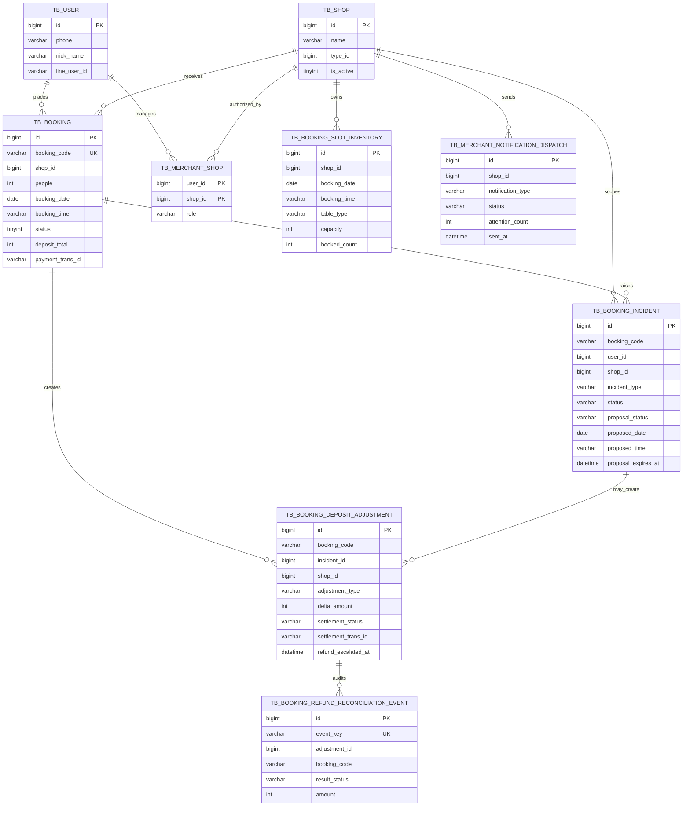

# ByteBites 訂位營運 ER Model

這份 ER model 聚焦作品中最重要的營運流程：推薦進入訂位、訂位可能產生臨場救場 incident、incident 可以產生替代時段提案，已付款訂位異動則可能產生補款或退款營運狀態。

它刻意不畫出所有 crawler、taxonomy、review、ABSA 或 cache table。面試或 reviewer 審查時，最有價值的是 Java 擁有的 operational state model。

## 核心資料表

| 資料表 | 角色 |
|---|---|
| `tb_user` | 顧客或商家帳號。 |
| `tb_shop` | 餐廳資料與商家營運單位。 |
| `tb_merchant_shop` | 商家帳號與可管理店家的授權 mapping。 |
| `tb_booking_slot_inventory` | Java 擁有的可訂位庫存，用於訂位與替代時段驗證。 |
| `tb_booking` | 訂位 source of truth，包含 booking code、人數、時間、付款狀態與訂金總額。 |
| `tb_booking_incident` | 臨場救場 incident，以及 portfolio 版本中的單一 pending proposal 狀態。 |
| `tb_booking_deposit_adjustment` | 已付款訂位異動後產生的補款或退款 adjustment。 |
| `tb_booking_refund_reconciliation_event` | 退款 request / reconciliation callback 的 idempotent audit log。 |
| `tb_merchant_notification_dispatch` | 商家營運通知的 cooldown 與 audit 狀態。 |

## Diagram

GitHub 可以直接顯示下方 Mermaid 圖。若要給面試官或簡報使用，也可以打開 dbdiagram 版本：

- DBML source：[docs/dbml/bytebites-booking-operations.dbml](dbml/bytebites-booking-operations.dbml)
- 使用方式：將 DBML 內容貼到 dbdiagram.io，即可產生可縮放的 ER 圖。
- 建議講法：這不是全庫 schema，而是 booking operations bounded context；目標是說清楚 Java-owned state。



## 設計重點

- `tb_booking.booking_code` 是 Web、LINE、incident、payment、refund operations 共用的穩定 workflow key。
- `tb_booking_incident` 在 portfolio 版本中保留目前 proposal：一個 incident、一個 pending proposal。若未來要做多輪協商，proposal history 應拆成獨立資料表。
- `tb_booking_deposit_adjustment` 將訂位異動與金流義務分離。已付款訂位如果改動後需要補款或退款，不會靜默改掉 booking state，而是建立 adjustment。
- `tb_booking_refund_reconciliation_event` 是 append-only audit state，用於 PSP callback 與 idempotent replay。
- `tb_merchant_shop` 是商家 API 的授權邊界；商家後台不應繞過這張表直接查所有店家。
- `tb_booking_slot_inventory` 是 Java 擁有的 demo availability，因此 incident proposal 與 booking changes 在審查時是 deterministic 的。

## 正規化檢查

這個 ER model 的目標是呈現 booking operations bounded context，而不是把整個資料庫畫成一張大圖。以第一、第二、第三正規化來看，核心交易模型是合理的，但有幾個刻意保留的 operational snapshot 欄位需要說清楚。

| 正規化 | 判斷 | 說明 |
|---|---|---|
| 第一正規化（1NF） | 符合 | 每個欄位都保存單一值：日期、時間、人數、狀態、金額、LINE user id、event key 都是 atomic value。沒有把多筆 incident、proposal 或 refund event 塞進同一個欄位。 |
| 第二正規化（2NF） | 符合 | 大多數表使用 surrogate primary key；唯一需要注意的複合 key 是 `tb_merchant_shop(user_id, shop_id)`，其中 `role` 依賴完整的使用者與店家組合，而不是只依賴其中一邊。 |
| 第三正規化（3NF） | 核心符合，少數欄位是有意識的 snapshot | `tb_booking`、`tb_booking_incident`、`tb_booking_deposit_adjustment`、`tb_booking_refund_reconciliation_event` 各自保存自己的狀態，不把商家資料、顧客資料或退款 audit 混在同一張表。例外是 adjustment 和 notification dispatch 會保存當下金額與統計 snapshot，這是為了 auditability，而不是查詢不到原始資料。 |

### 刻意保留的 tradeoff

- `tb_booking_incident` 目前把 proposal 欄位放在同一張表，因為 portfolio 版本只允許一個 incident 有一個 pending proposal。這讓狀態機簡單，也讓 LINE/Web 的 accept / decline path 清楚。若未來要支援多輪協商，應拆出 `tb_booking_incident_proposal` 保存 proposal history。
- `tb_booking_deposit_adjustment` 保存 `current_deposit_total`、`proposed_deposit_total` 與 `delta_amount`。`delta_amount` 可以由前兩者計算，但在金流與營運審計中保留當時決策 snapshot 比純粹消除冗餘更重要。
- `tb_merchant_notification_dispatch` 保存 `attention_count`、`pending_escalation_count`、`escalated_count` 等通知當下的摘要。這些值可由 refund operations 查詢重算，但 notification dispatch 是一筆已發送或已跳過的營運紀錄，需要保留當時內容。
- `booking_code` 是穩定 workflow key，`id` 是資料庫主鍵。Web、LINE、incident、refund audit 以 `booking_code` 串流程，可以避免把內部 row id 暴露到外部通道；資料庫內仍保留 `id` 作為 primary key。

面試時可以這樣回答：

```text
核心模型遵守 1NF / 2NF / 3NF；少數看起來像冗餘的欄位是 audit snapshot。
我沒有為了教科書式正規化把所有營運紀錄拆到很碎，因為付款、退款、通知與 incident proposal 需要保留當下決策狀態。
如果產品要支援多輪 incident 協商，第一個會拆出的就是 proposal history table。
```
