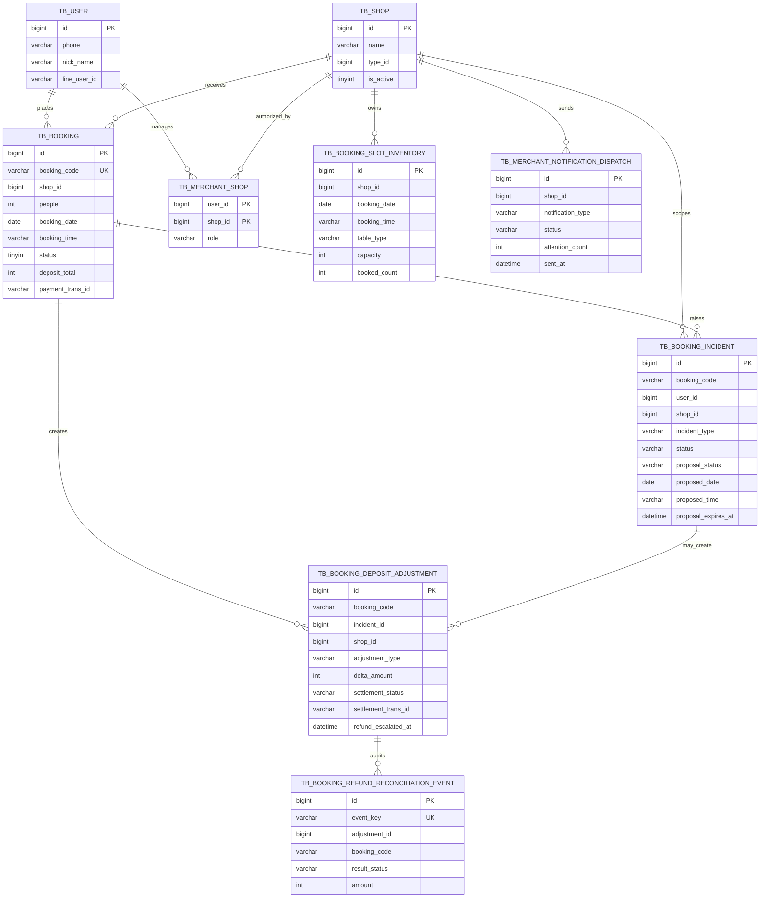

# ByteBites 訂位營運 ER Model

這份 ER model 聚焦作品中最重要的營運流程：推薦進入訂位、訂位可能產生臨場救場 incident、incident 可以產生替代時段提案，已付款訂位異動則可能產生補款或退款營運狀態。

它刻意不畫出所有 crawler、taxonomy、review、ABSA 或 cache table。面試或 reviewer 審查時，最有價值的是 Java 擁有的 operational state model。

## 核心資料表

| 資料表 | 角色 |
|---|---|
| `tb_user` | 顧客或商家帳號。 |
| `tb_shop` | 餐廳資料與商家營運單位。 |
| `tb_merchant_shop` | 商家帳號與可管理店家的授權 mapping。 |
| `tb_booking_slot_inventory` | Java 擁有的可訂位庫存，用於訂位與替代時段驗證。 |
| `tb_booking` | 訂位 source of truth，包含 booking code、人數、時間、付款狀態與訂金總額。 |
| `tb_booking_incident` | 臨場救場 incident，以及 portfolio 版本中的單一 pending proposal 狀態。 |
| `tb_booking_deposit_adjustment` | 已付款訂位異動後產生的補款或退款 adjustment。 |
| `tb_booking_refund_reconciliation_event` | 退款 request / reconciliation callback 的 idempotent audit log。 |
| `tb_merchant_notification_dispatch` | 商家營運通知的 cooldown 與 audit 狀態。 |

## Diagram

## 設計重點

- `tb_booking.booking_code` 是 Web、LINE、incident、payment、refund operations 共用的穩定 workflow key。
- `tb_booking_incident` 在 portfolio 版本中保留目前 proposal：一個 incident、一個 pending proposal。若未來要做多輪協商，proposal history 應拆成獨立資料表。
- `tb_booking_deposit_adjustment` 將訂位異動與金流義務分離。已付款訂位如果改動後需要補款或退款，不會靜默改掉 booking state，而是建立 adjustment。
- `tb_booking_refund_reconciliation_event` 是 append-only audit state，用於 PSP callback 與 idempotent replay。
- `tb_merchant_shop` 是商家 API 的授權邊界；商家後台不應繞過這張表直接查所有店家。
- `tb_booking_slot_inventory` 是 Java 擁有的 demo availability，因此 incident proposal 與 booking changes 在審查時是 deterministic 的。
